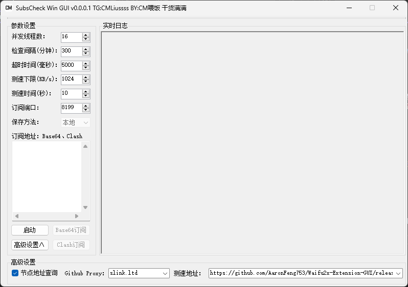

# SubsCheck-Win-GUI
首先声明，这款软件并非我原创开发。Subs-Check是由 [bestruirui](https://github.com/bestruirui/BestSub) 原创、由[beck-8](https://github.com/beck-8/subs-check)进行二次开发，而我所编写的GUI是在这两位开发者的原始版本基础上进行的**二次开发**。

- **Telegram交流群：[@CMLiussss](https://t.me/CMLiussss)**

# 免责声明
SubsCheck 相关项目仅供教育、研究和安全测试目的而设计和开发。本项目旨在为安全研究人员、学术界人士及技术爱好者提供一个探索和实践网络通信技术的工具。
在下载和使用本项目代码时，使用者必须严格遵守其所适用的法律和规定。使用者有责任确保其行为符合所在地区的法律框架、规章制度及其他相关规定。

### 使用条款

- **教育与研究用途**：本软件仅可用于网络技术和编程领域的学习、研究和安全测试。
- **禁止非法使用**：严禁将 **SubsCheck-Win-GUI** 用于任何非法活动或违反使用者所在地区法律法规的行为。
- **使用时限**：基于学习和研究目的，建议用户在完成研究或学习后，或在安装后的**24小时内，删除本软件及所有相关文件。**
- **免责声明**：**SubsCheck-Win-GUI** 的创建者和贡献者不对因使用或滥用本软件而导致的任何损害或法律问题负责。
- **用户责任**：**用户对使用本软件的方式以及由此产生的任何后果完全负责。**
- **无技术支持**：本软件的创建者不提供任何技术支持或使用协助。
- **知情同意**：使用 **SubsCheck-Win-GUI** 即表示您已阅读并理解本免责声明，并同意受其条款的约束。

**请记住**：本软件的主要目的是促进学习、研究和安全测试。作者不支持或认可任何其他用途。使用者应当在合法和负责任的前提下使用本工具。

---



## GUI文件结构
```shell
subs-check.win.gui.exe      # GUI本体
subs-check.exe                      # subs-check x86_32位 原程序本体
config
 └─ config.yaml                    # subs-check 配置文件
output
 ├─ all.txt                                # base64格式 测试结果
 └─ all.yaml                            #yaml格式 测试结果
Newtonsoft.Json.dll           # 验证版本信息组件
Newtonsoft.Json.xml        # 验证版本信息组件
YamlDotNet.dll                    # Yaml读写组件
YamlDotNet.xml                  # Yaml读写组件
```

# 致谢
[beck-8](https://github.com/beck-8/subs-check)、[bestruirui](https://github.com/bestruirui/BestSub)